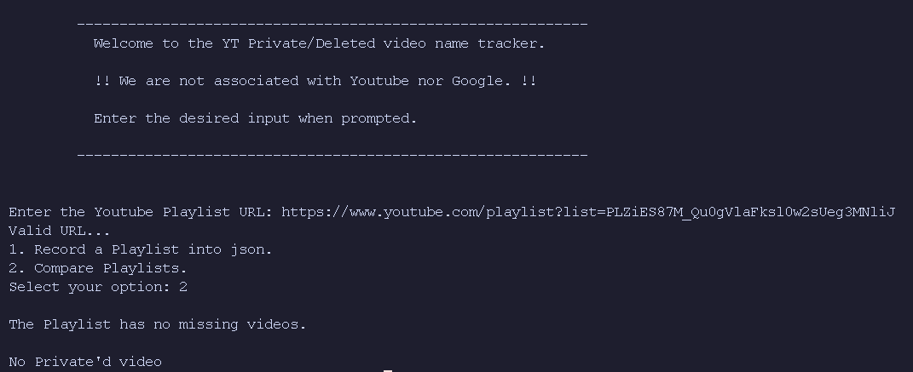

# Scenario
I personally like using Youtube as a Music Platform, not even Youtube Music but Youtube itself.  
# Why?
Because Youtube has cover videos and very niche musical videos that may not be found in any other platform since those videos may not be a commercialized piece but rather just content
a user wished to share.

# Problem
Within the playlists there's 4 types of videos.
1. Official Music Videos (Uploaded by the Original Author)
2. Covers of Music Videos
3. Niche Videos
4. Music Videos from 'Topic' Channels.

For X reason, the videos that come from Topic Channels are prone to be deleted or privated. Once this happens, I lose track of the song forever. The video changes the title to '[Deleted Video]' or ['Privated Video']. 
Furthermore, Covers are also prone of being deleted or privated which causes the same issue. 

# Code
The code helps me solve this issue by recording the IDs and Titles of the videos and store them in json format. 
 
 
If the case arises that a video is privated or deleted: 
&emsp;The code helps me compare the recorded IDs and Titles of the playlists to the current one, and point out which one has been deleted or privated.
 
